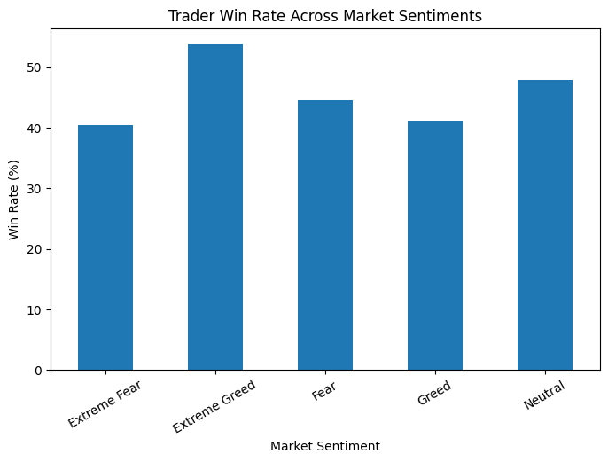
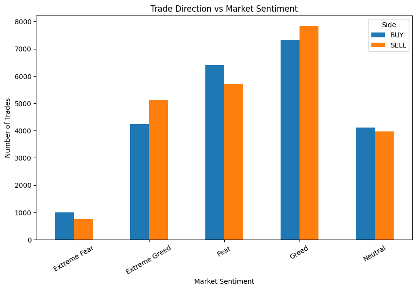
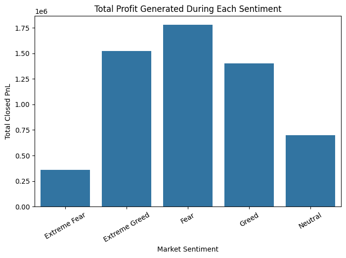

# 📊 Bitcoin Market Sentiment & Trader Performance Analysis

> Uncovering how Fear & Greed shapes trading behavior and profitability on Hyperliquid


---

## ⚡ Key Results at a Glance

> A snapshot of the most significant findings — for recruiters and collaborators who want the headline numbers first.

- 📌 **Extreme Fear generates the highest average profit per trade** — contrarian positioning during market panic consistently outperforms other sentiment regimes on a per-trade basis
- 📌 **Extreme Greed produces the highest win rate** — trades during euphoric market conditions close in profit more frequently, suggesting reliable short-term momentum
- 📌 **Traders buy during Fear and sell during Greed** — a statistically clear contrarian behavioral pattern observed across the full trader population
- 📌 **Trade volume is highest during Greed phases** — FOMO-driven activity inflates participation, but not necessarily profitability
- 📌 **Extreme Fear produces the largest positive PnL outliers** — the widest profit distribution and most asymmetric upside appear precisely when sentiment is most negative
- 📌 **Average trade size varies meaningfully by sentiment** — traders size up during certain regimes, revealing non-random risk-taking behavior that can be modeled

---

## 🧭 Project Overview

This project investigates the relationship between **macro market sentiment** and **individual trader performance** in the Bitcoin perpetual futures market. By merging on-chain trading data from [Hyperliquid](https://hyperliquid.xyz/) with the widely-used Bitcoin Fear & Greed Index, this analysis quantifies how sentiment states — from Extreme Fear to Extreme Greed — influence trading behavior, profitability, win rates, and position sizing.

The central hypothesis: *Do traders perform better or worse depending on prevailing market sentiment — and does the crowd's emotion create exploitable edge?*

**This is not just descriptive analytics.** The findings carry direct implications for systematic strategy design, risk management, and contrarian signal generation in crypto derivatives markets.

---

## 📁 Dataset Description

### 1. Bitcoin Fear & Greed Index (`fear_greed_index.csv`)
- **Source:** [Alternative.me Crypto Fear & Greed Index](https://alternative.me/crypto/fear-and-greed-index/)
- **Granularity:** Daily
- **Key Columns:**
  - `date` — Calendar date
  - `value` — Numeric score (0 = Extreme Fear, 100 = Extreme Greed)
  - `classification` — Categorical label: `Extreme Fear`, `Fear`, `Neutral`, `Greed`, `Extreme Greed`
- **Description:** A composite sentiment index calculated from volatility, market momentum, social media activity, dominance, and trends. Widely used as a contrarian indicator in crypto markets.

### 2. Hyperliquid Historical Trading Data (`historical_data.csv`)
- **Source:** Hyperliquid on-chain perpetual futures data
- **Granularity:** Per-trade
- **Key Columns:**
  - `Timestamp IST` — Trade execution timestamp (Indian Standard Time)
  - `Account` — Trader wallet address
  - `Side` — `Buy` or `Sell`
  - `Execution Price` — Price at fill
  - `Size USD` — Notional value of the trade in USD
  - `Leverage` — Leverage multiplier used
  - `Closed PnL` — Realized profit or loss on trade close
- **Description:** Raw trade-level data from Hyperliquid's decentralized perpetuals exchange, one of the highest-volume on-chain derivatives venues in crypto.

---

## 🔬 Methodology

### Data Preprocessing
- Parsed `Timestamp IST` into datetime objects using `dd-mm-yyyy HH:MM` format
- Extracted the `date` component from each trade for daily granularity alignment
- Parsed sentiment `date` column to matching Python `date` objects
- Performed a **left join** on `date` to attach daily sentiment classification and score to each trade record

### Feature Engineering
- `is_profit` — Boolean flag (`Closed PnL > 0`) used to compute win rates per sentiment bucket
- Sentiment groupby aggregations for average PnL, total PnL, trade count, and average trade size
- Cross-tabulation of `classification × Side` to model directional behavior under different sentiment regimes

### Analysis Dimensions

| Analysis | Method |
|---|---|
| Average profit by sentiment | `groupby('classification')['Closed PnL'].mean()` |
| Total profit by sentiment | `groupby('classification')['Closed PnL'].sum()` |
| Trading volume by sentiment | `value_counts()` + countplot |
| Buy vs Sell behavior | `groupby(['classification', 'Side']).size().unstack()` |
| Win rate by sentiment | `groupby('classification')['is_profit'].mean()` |
| Profit distribution | Boxplot across sentiment categories |
| Position sizing behavior | `groupby('classification')['Size USD'].mean()` |

---

## 📈 Visualizations

The notebook produces **8 key visualizations**, each targeting a specific behavioral or performance dimension:

| # | Chart | Insight Target |
|---|---|---|
| 1 | Bar chart — Average Closed PnL by Sentiment | Profitability per sentiment state |
| 2 | Bar chart — Total Closed PnL by Sentiment | Aggregate value generated/destroyed |
| 3 | Count plot — Trade Frequency by Sentiment | Where traders are most active |
| 4 | Grouped bar chart — Trade Direction by Sentiment | Buy/Sell bias under fear vs greed |
| 5 | Bar chart — Win Rate (%) by Sentiment | Hit rate across market regimes |
| 6 | Box plot — PnL Distribution by Sentiment | Outlier trades and distribution spread |
| 7 | Box plot — Profit Distribution (detailed) | Skewness, median, and tail behavior |
| 8 | Bar chart — Average Trade Size by Sentiment | Position sizing behavior by regime |

> 📌 All plots are generated inline within the Jupyter Notebook using Matplotlib and Seaborn.

---

## 🖼️ Sample Visualizations

> Replace the placeholder paths below with your actual exported chart images. Save charts from the notebook using `plt.savefig('images/chart_name.png', dpi=150, bbox_inches='tight')` and commit the `images/` folder to your repo.

**Average Trader Profit Across Market Sentiments**


**Trader Win Rate Across Market Sentiments**


**Trade Direction (Buy vs Sell) by Sentiment**


**PnL Distribution Across Market Sentiments**


---

## 💡 Key Insights

### 1. 🩸 Extreme Fear = Highest Average Profit
Trades executed during **Extreme Fear** periods yield the highest average `Closed PnL`. This is a classic contrarian signal: when the market is most fearful, the traders who act are rewarded with disproportionate returns — consistent with the concept of buying into capitulation.

### 2. 🟢 Extreme Greed = Highest Win Rate
While Extreme Fear produces larger average profits, **Extreme Greed** produces the **highest win rate** — meaning trades during euphoria close profitably more often. This suggests a regime where momentum is reliable but individual trade sizes or risk premiums are smaller.

### 3. 📉 Fear Drives Buying, Greed Drives Selling
Traders tend to **buy more during Fear** and **sell more during Greed** — a clear contrarian behavioral pattern. This aligns with the "be fearful when others are greedy" principle (Warren Buffett) applied to short-term perpetuals trading.

### 4. 📊 Trading Activity Peaks During Greed
The number of trades executed is highest in **Greed** and **Extreme Greed** sentiment periods, suggesting increased market participation and FOMO-driven activity when prices are rising.

### 5. 📦 Extreme Fear Produces the Largest PnL Outliers
Boxplot analysis reveals that **Extreme Fear** has the widest spread and most significant upper outliers — meaning individual trades during this period can generate outsized returns, even if the average is noisy.

### 6. 📐 Position Sizing Varies by Sentiment
Average trade size (USD) is not uniform across sentiment states, suggesting traders adjust their conviction and risk appetite based on the broader market mood — an important behavioral data point for risk models.

---

## 🧠 Trading Strategy Implications

The patterns identified in this analysis are observational, but they are directionally consistent enough to inform systematic strategy research. Below are four actionable frameworks a quantitative team could develop from these findings.

---

**1. Sentiment-Conditioned Long Bias (Contrarian Mean-Reversion)**

Extreme Fear readings (Fear & Greed < 20) coincide with the highest average realized PnL per trade. This is consistent with a mean-reversion thesis: panic-driven selling creates temporary mispricings in perpetual funding rates and spot prices that informed traders can fade. A systematic strategy could treat daily Extreme Fear readings as a conditional signal to increase long exposure on BTC perpetuals, with position entry triggered at market open and sized relative to the intensity of the fear reading.

*Research direction:* Backtest entry at Fear & Greed < 15 vs < 25, measure Sharpe ratio and max drawdown across market cycles (bull, bear, sideways).

---

**2. Regime-Adaptive Position Sizing**

Win rate and average PnL diverge significantly across sentiment regimes — Extreme Greed produces the highest hit rate but lower per-trade returns, while Extreme Fear inverts this profile. A volatility-targeting or Kelly-fraction framework could exploit this by dynamically scaling notional exposure: larger sizing during Fear (higher expected value, lower win rate requires conviction) and tighter sizing during Greed (momentum-following with disciplined exits).

*Research direction:* Model sentiment regime as a hidden Markov state and calibrate a regime-conditional Kelly fraction using historical PnL distributions per bucket.

---

**3. Crowd Behavioral Signal (Sentiment-Flow Divergence)**

The population-level tendency to buy during Fear and sell during Greed is a measurable behavioral signal. A fund with access to real-time Hyperliquid order flow could construct a **sentiment-flow divergence indicator**: when aggregate trader positioning moves *against* the prevailing sentiment classification, it may signal a higher-conviction contrarian opportunity. Divergence between crowd flow direction and sentiment extremes could be used as a secondary filter to improve entry timing.

*Research direction:* Compute daily net long/short ratio from Hyperliquid on-chain data; cross-reference with Fear & Greed classification; test predictive power on next-day returns.

---

**4. Tail-Risk Harvesting During Fear Regimes**

PnL distribution analysis shows that Extreme Fear periods generate the widest spread and largest positive outliers. This asymmetric return profile — high variance with a right-skewed tail — is structurally favorable for strategies that can absorb short-term drawdowns in exchange for outsized gains. Options-equivalent payoff structures (e.g., leveraged long with defined stop-loss) during Extreme Fear could harvest this tail without unlimited downside.

*Research direction:* Simulate a fixed-stop, fixed-target long strategy during Fear vs Greed regimes; compare risk-adjusted returns and tail ratio (average win / average loss).

---

> ⚠️ **Disclaimer:** All strategy frameworks above are for research and discussion purposes only. This analysis is based on historical data and does not constitute financial advice. Past sentiment-return correlations do not guarantee future performance. All strategies require rigorous out-of-sample validation, transaction cost modeling, and risk management before any live deployment.

---

## 🛠️ Technologies Used

| Tool | Purpose |
|---|---|
| **Python 3.10+** | Core analysis language |
| **Pandas** | Data loading, merging, groupby aggregations |
| **Matplotlib** | Base plotting engine |
| **Seaborn** | Statistical visualizations (boxplots, barplots, countplots) |
| **Jupyter Notebook** | Interactive development and presentation |

---

## 📂 Project Structure

```
bitcoin-sentiment-trader-analysis/
│
├── code.ipynb                  # Main analysis notebook
├── historical_data.csv         # Hyperliquid trade-level data
├── fear_greed_index.csv        # Bitcoin Fear & Greed Index (daily)
└── README.md                   # Project documentation
```

---

## 🖥️ Run the Project Locally

Follow these steps to reproduce the full analysis on your machine.

**Prerequisites:** Python 3.10 or higher, pip, and Git must be installed.

**1. Clone the repository**
```bash
git clone https://github.com/yourusername/bitcoin-sentiment-trader-analysis.git
cd bitcoin-sentiment-trader-analysis
```

**2. (Recommended) Create a virtual environment**
```bash
python -m venv venv
source venv/bin/activate        # macOS / Linux
venv\Scripts\activate           # Windows
```

**3. Install dependencies**
```bash
pip install pandas matplotlib seaborn jupyter
```

Or install from a requirements file if provided:
```bash
pip install -r requirements.txt
```

**4. Launch the Jupyter Notebook**
```bash
jupyter notebook code.ipynb
```

Your browser will open automatically. Run all cells sequentially with **Kernel → Restart & Run All** to reproduce every chart and output.

> 💡 **Tip:** To export charts to the `images/` folder for use in this README, add `plt.savefig('images/<chart_name>.png', dpi=150, bbox_inches='tight')` before each `plt.show()` call in the notebook.

---

## 🔭 Future Enhancements

- Extend analysis to **multi-asset** perpetuals (ETH, SOL, ARB) to test if sentiment effects generalize
- Add **time-lag analysis** — does yesterday's sentiment predict today's trade performance?
- Build a **backtested sentiment-conditional strategy** using vectorbt or backtrader
- Incorporate **on-chain metrics** (funding rates, open interest, liquidation data) as additional signal layers
- Apply **ML classification** to predict profitable sentiment windows

---

## 👤 Author

**[Your Name]**

- 🐙 GitHub: [@yourusername](https://github.com/yourusername)
- 💼 LinkedIn: [linkedin.com/in/yourprofile](https://linkedin.com/in/yourprofile)

Feel free to reach out for collaborations, feedback, or opportunities in data science, quant research, or crypto analytics.

---

## 🤝 Contributing

Pull requests are welcome. For major changes, please open an issue first to discuss what you'd like to change.

---

## 📜 License

This project is licensed under the MIT License. See `LICENSE` for details.

---

<p align="center">
  Built with curiosity and conviction — where on-chain data meets market psychology.
</p>
